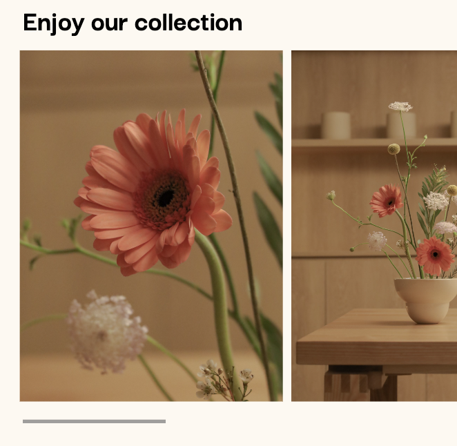

# Procesverslag
Markdown is een simpele manier om HTML te schrijven.  
Markdown cheat cheet: [Hulp bij het schrijven van Markdown](https://github.com/adam-p/markdown-here/wiki/Markdown-Cheatsheet).

Nb. De standaardstructuur en de spartaanse opmaak van de README.md zijn helemaal prima. Het gaat om de inhoud van je procesverslag. Besteedt de tijd voor pracht en praal aan je website.

Nb. Door *open* toe te voegen aan een *details* element kun je deze standaard open zetten. Fijn om dat steeds voor de relevante stuk(ken) te doen.

## Jij

  
uitwerken voor kick-off werkgroep

  ### Auteur:
  Chanté de Ruiter

  #### Je startniveau:
  Blauw

  #### Je focus:
  Responsive 
 

## Je website

  
uitwerken voor kick-off werkgroep

  ### Je opdracht:
  https://www.soilboy.sg

  #### Screenshot(s) van de eerste pagina (small screen): 
  Workshops pagina
  

  #### Screenshot(s) van de tweede pagina (small screen):
  Plantcare pagina   
  
 

## Toegankelijkheidstest 1/2 (week 1)

  
uitwerken na test in 2e werkgroep

  ### Bevindingen
  - Bij de validator kwamen er best veel errors naar voren. Dit komt door het voormatig gebruik van div's. 
  
  - Ook gebruikt de website geen headings en zie ik zelden een h1. 
  
  - Er zit geen media in de website en er zijn ook geen links die openen naar een nieuwe tab of pagina. 
  
  - Bij het veranderen naar reduced motion, zijn er een paar animaties die anders worden en langzamer gaan. 

  - De website is waarschijnlijk gemaakt met iets anders dan een code editor.

## Breakdownschets (week 1)

  
uitwerken na afloop 3e werkgroep

  ### de hele pagina: 
  

  ### dynamisch deel (bijv menu): 
  

## Voortgang 1 (week 2)

  
uitwerken voor 1e voortgang

  ### Stand van zaken
  hier dit ging goed & dit was lastig (neem ook screenshots op van delen van je website en code)
  
  

- Het was lastig om een grid te maken die mee bewoog met de pagina.

- Ik had mijn logo goed neer kunnen zetten en deze was ook responsive in het midden van de pagina.

  ### Agenda voor meeting
  samen met je groepje opstellen

  Chanté: Waarom mijn grid niet werkt, terwijl het er wel goed in staat.

  Marelva: Hoe kan ik de tekst aanpassen, zonder dat alles mee aanpast?

  Meike: SVG image komt er niet in.

  Jens: Hoe de achtergrond mooi kan verlopen in het geheel.

  ### Verslag van meeting
  hier na afloop snel de uitkomsten van de meeting vastleggen

  - Ik had de main aangeroepen, maar de main was nog niet in de HTML.

  - De opdrachten van de les maken, waardoor je veel meer kan snappen en maken.

## Voortgang 2 (week 3)

  
uitwerken voor 2e voortgang

  ### Stand van zaken
  (neem ook screenshots op van delen van je website en code)

   - Nadat ik hulp had gevraagd ging het maken van een grid goed en kon ik de pagina goed aanpassen. Ik ben bijna klaar met de footer van de eerste pagina, maar hij zit niet aan de onderkant van de pagina.

  

  ### Agenda voor meeting
  samen met je groepje opstellen

  Chanté: Hoe krijg ik een spatie weg bij de footer aan het eind van de pagina?

  Marelva: Geen vragen.

  Meike: Geen vragen.

  Jens: Hoe krijg ik het hamburger menu werkend?

  ### Verslag van meeting
  hier na afloop snel de uitkomsten van de meeting vastleggen

  - Ik moet hard werken om een goed resultaat te leveren.
  - Bij de footer moet er overflow hidden staan.
  - De pagina moet doorheen getabd kunnen worden.

## Toegankelijkheidstest 2/2 (week 4)

  
uitwerken na test in 9e werkgroep

  ### Bevindingen
  - Ik moet nog een hamburger menu maken.
  - Ik kan nog media toevoegen.
  - Dark mode nog toevoegen.
  - Animaties toevoegen.
  - Linkjes goed toevoegen, zodat de tab er niet overheen skipt.

## Voortgang 3 (week 4)

  
uitwerken voor 3e voortgang

  ### Stand van zaken
  hier dit ging goed & dit was lastig (neem ook screenshots op van delen van je website en code)

  

- Het maken van mijn footer ging goed.

- Het positioneren van mijn content op de tweede pagina ging lastig.

  ### Agenda voor meeting
  samen met je groepje opstellen

  Chanté: Hoe krijg ik mijn menu button in de hoek? Hoe kan ik het beste mijn tweede pagina aanpakken.

  Marelva: Hoe kan ik een gedeelte van mijn website animeren?

  Meike: Het positioneren van een klein gedeelte van mijn content gaat lastig.

  Jens: Hoe kan meer toegankelijkheid toevoegen.

  ### Verslag van meeting
  hier na afloop snel de uitkomsten van de meeting vastleggen

  - Datum en tijd kunnen met een speciale tag toegevoegd worden.
  - Articles kunnen ook gebruikt worden.
  - Animaties moeten met transform en transition ook nog aangepast worden.

## Eindgesprek (week 5)

  
uitwerken voor eindgesprek

  ### Je uitkomst - karakteristiek screenshots:
  

 

  ### Dit ging goed/Heb ik geleerd: 
  Korte omschrijving met plaatjes

  

  - Het maken en begrijpen van een grid.

  

  - Het maken van een form.

  

  - Het maken van een image scroll.

  ### Dit was lastig/Is niet gelukt:
  Korte omschrijving met plaatjes

  
  
  - Het maken van een image slider.

## Bronnenlijst

  
continu bijhouden terwijl je werkt

  Nb. Wees specifiek ('css-tricks' als bron is bijv. niet specifiek genoeg). 
  Nb. ChatGpT en andere AI horen er ook bij.
  Nb. Vermeld de bronnen ook in je code.

  1. https://developer.mozilla.org/en-US/docs/Web/CSS/position
  2. https://www.w3schools.com/tags/att_video_controls.asp
  3. https://developer.mozilla.org/en-US/docs/Web/CSS/:focus-visible
  4. https://stackoverflow.com/questions/6805482/css3-transition-animation-on-load
  5. https://css-tricks.com/almanac/properties/o/outline/
  6. https://www.youtube.com/watch?v=3y_aF9z7BV4
  7. https://zellwk.com/blog/style-hover-focus-active-states/
  8. https://chat.openai.com
  9. https://stackoverflow.com/questions/43060941/figure-slider-stacks
  10. https://www.w3schools.com/howto/howto_css_zoom_hover.asp
  11. https://developer.mozilla.org/en-US/docs/Web/Accessibility/ARIA/Attributes/aria-hidden#

